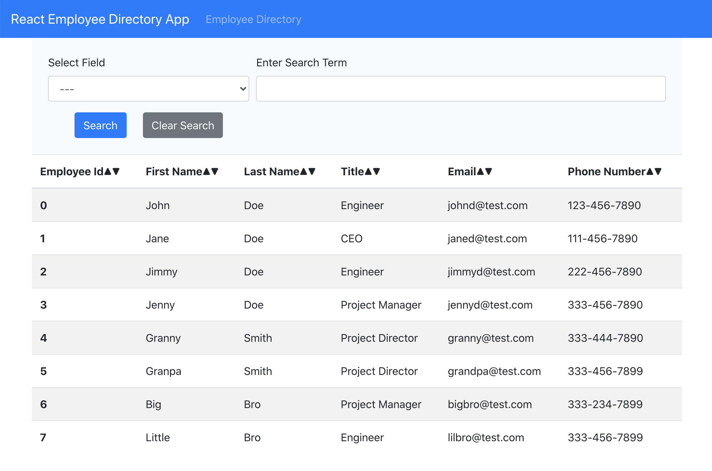

# React Employee Directory App 

## Description

Workout Tracker that utilizes MongoDB database to track a user's daily exercises such as bench presses or running. Weekly workout stats are charted using Chart.js. 

Deployed Site: <https://mc4506.github.io/react-employee-directory/>

## Table of Contents

* [Installation](#installation)
* [Usage](#usage)
* [License](#license)

## Installation

clone this Repo. Visit the deployed page link.

## Usage

## License

Licensed under MIT License.

## Questions

Contact [mc4506](mailto:mike4506@gmail.com)